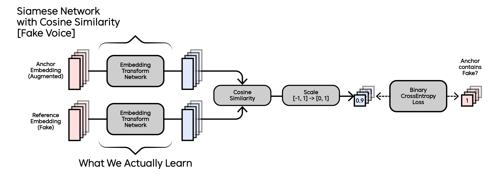

# SW중심대학 디지털 경진대회 : AI 부문


## Team
Team Name: 코스모스<br/>
Team Member: 박웅, 유민주, 박제현, 김홍권, 박민규

## Abstract

- Competition Period

| Competition Type | Period                              |
|------------------|-------------------------------------|
| Preliminary      | 2024.07.01 10:00 ~ 2024.07.19 09:59 |
| Final            | 2024.08.06 10:00 ~ 2024.08.06 18:30 |

- Result and Accomplishment

| Competition Type | Result                  | Note                              |
|------------------|-------------------------|-----------------------------------|
| Preliminary      | Public: 6th, Private 6th | Public: 0.17125, Private: 0.17077 |
| Final            | 6th                     | 소프트웨어협회장상(우수상)                    |

<hr/>

## Versions
| Component | Version |
|-----------|---------|
| Python    |3.9.13|
| Torch     |2.0.1+cu117|
| CUDA      |11.7|
| cuDNN     |8.5.0|

Every Version of Library is Described in ```requirements.txt```.

<hr/>

## Data Directory Setting

Unzip ```open.zip``` file which you can download from dacon competition page into ```./data``` directory.

- Hierarchy

```
2024SWAICompetition
+-- data
|   +-- open
|   |   +-- test
|   |   +-- test_emb
|   |   +-- train
|   |   +-- train_aug
|   |   |   +-- 0
|   |   |   +-- 1
|   |   |   +-- 2
|   |   |   +-- 3
|   |   |   +-- 4
|   |   |   +-- 5
|   |   +-- train_aug_emb
|   |   |   +-- 0
|   |   |   +-- 1
|   |   |   +-- 2
|   |   |   +-- 3
|   |   |   +-- 4
|   |   |   +-- 5
|   |   +-- train_emb
|   |   +-- unlabeled_data
+-- ensemble
+-- history
+-- ...
```

<hr/>

## Description

- ```./data/```: Data Directory<br/>
- ```./ensemble/```: Parameters for Ensembled Inference<br/>
- ```./history/```: Recorded Histories While Training<br/>
- ```./src/```: Source Files for Markdown<br/>
- ```./submission/```: Results of Inference Session<br/>
- ```./WeSpeaker_ResNet221/```: Embedding Network Directory<br/>
- ```./audio_to_embedding.py```: Convert Every Audio Files to Embedding Vectors<br/>
- ```./inference_multi_ensemble.py```: Make a New Inference File or Reproduce Previous Inference File<br/>
- ```./main.py```: Train Network with New Parameter<br/>
- ```./MainDataset.py```: Custom Dataset for Actual Training<br/>
- ```./MixedAudioDataset.py```: Data Augmentation Session Before Training<br/>
- ```./model.py```: Our Cosine-Similarity-Based Siamese Network<br/>
- ```./pred_analysis.py```: Check the Distribution of Prediction for Submission<br/>
- ```./test.py```: Calculate Each Metric Score of Every Parameter File<br/>
- ```./utils.py```: Utility Functions for this Project<br/>
- ```./config.yaml```: Configurations and Hyperparameters for Training

<hr/>

## How to Start

Notice: We recommend making a new virtual environment with above versions and ```requirements.txt```

### 1. Dataset Directory Setting

- Download ```open.zip``` from dacon competition page.
- Unzip ```open.zip``` into ```./data/``` directory.

### 2. Data Preparation

- Notice: If you download ```emb.zip``` from google drive, you can skip this session.
  - Unzip ```emb.zip``` into ```./data/open/``` directory.
- Run ```MixedAudioDataset.py``` to make mixed train data.
  - For our comfort, ```MixedAudioDataset.py``` is designed to run forever until you stop running. Please stop the session if you think that enough data is collected.
- Run ```audio_to_embedding.py``` to convert every audio files into embedding.

### 3. Train Model

- Run ```main.py``` to train a new model.

### 4. Test Model
- Run ```test.py``` to test and evaluate each parameter with various metric.

### 4. Inference Session

- Run ```inference_multi_ensemble.py``` to make a prediction file
- If you want to reproduce our final submission, set the variable ```reproduce``` to ```True```
- If you want to make a totally new prediction, set the variable ```reproduce``` to ```False```

<hr/>

## Key Figure



<hr/>

## Reference

- WeSpeaker

```
@inproceedings{wang2023wespeaker,
  title={Wespeaker: A research and production oriented speaker embedding learning toolkit},
  author={Wang, Hongji and Liang, Chengdong and Wang, Shuai and Chen, Zhengyang and Zhang, Binbin and Xiang, Xu and Deng, Yanlei and Qian, Yanmin},
  booktitle={IEEE International Conference on Acoustics, Speech and Signal Processing (ICASSP)},
  pages={1--5},
  year={2023},
  organization={IEEE}
}
```
